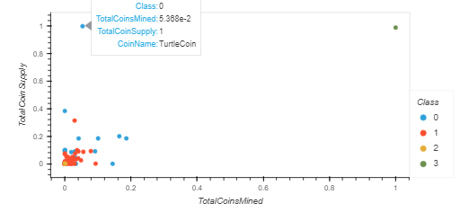

# Cryptocurrencies

## Project Overview
Are you trying to figure out what cryptocurrencies are on the trading market and want to know which ones are worth the investment? 

With unsupervised machine learning and Principal Component Analysis, we can group cryptocurrencies with a K-means clustering algorithm and check for any patterns or groups to best discover which cryptocurrencies we should invest in. 

## Results
With a scatter plot that charts Total Coin Supply and Total Coins Mined for each cryptocurrency, we can see that two cryptocurrencies are obvious outliers. Both TurtleCoin (upper left, shown in screenshot) and BitTorrent (upper right) have unique properties compared to the trends of other cryptocurrencies.

With overlapping data, a 3D chart may help us understand the data a little better. In the following plot we can see that BitTorrent is in a class of its own, while class 0 and 1 have strong groupings near one another, and there are only a few class 2 points grouped together. 

